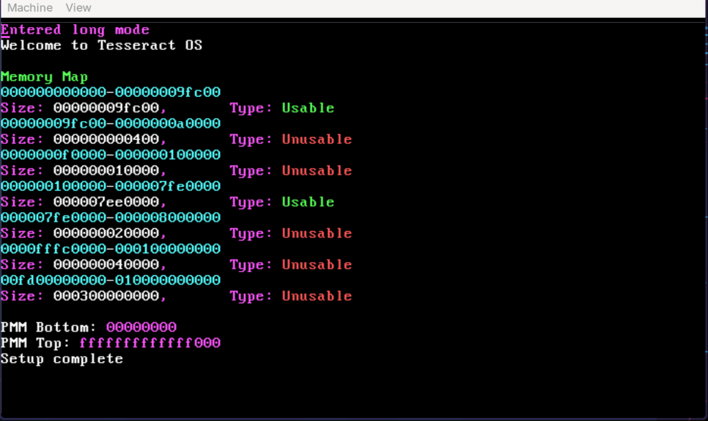
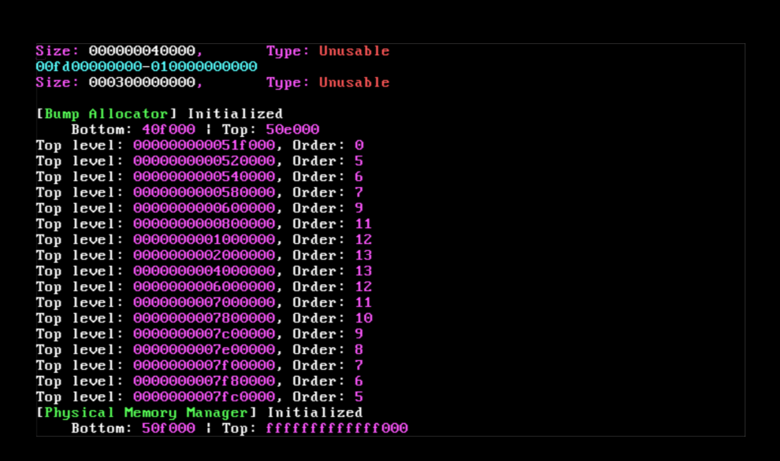
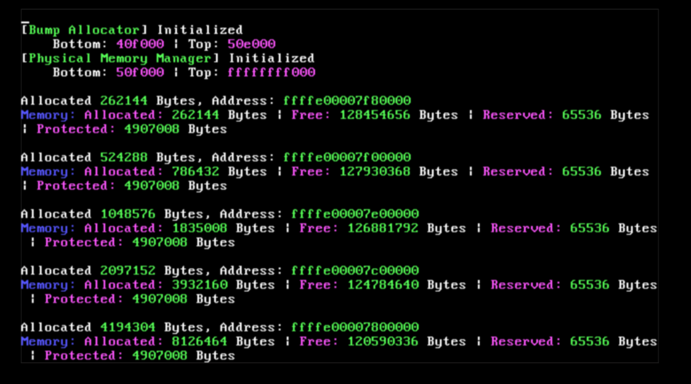
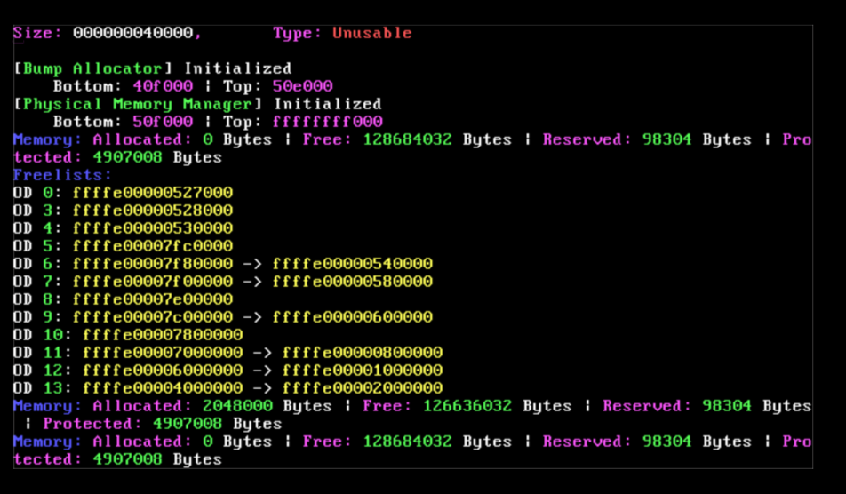

# TesseractOS

### About the project

  <b>TesseractOS</b> is a 64 bit OS being developed by me as a personal hobby project to learn about OS design of
  modern kernels like Linux and NT. I base off many design decisions on their internals mainly to explore
  how they scale to real systems but also diverge when I feel its necessary or look at new ideas. Currently its
  targeting x86_64.

  As a core design philosophy, the focus is more on building it bottom-up, subsystems first and features second.
  Because I aim to to explore the design, workarounds and challenges faced by modern OSes on real hardware to accomplish
  systemic goals as opposed to targeting features and milestones.

  As <i>handmade</i> implies, this project has no LLM generated code and this will be true as it grows, as this is a hobby
  project with the aim of understanding and implementing every aspect.

### Progress and Features
Currently, it is in early stages of development and most of the work done is bootstrapping. But here
are some of the things I've worked with: 
* <b>Boot</b>
  - Grub is used as the primary bootloader with multiboot2 spec. Only BIOS is supported currently.
  - <b>boot32</b> is a 32 bit bootstrap bootloader and <b>kernel64</b> is the 64 bit kernel, both being compiled to ELF binaries.
  - Grub loads <b>boot32</b> in 32 bit protected mode which then sets up primitives, GDT, IDT and long mode paging.
    It includes an ELF64 parser which loads the kernel64 image (passed as multiboot2 module) in long mode into higher half virtual memory.

* <b>Memory Management (WIP) </b>
  - A bump allocator is used primitively while bootstrapping the PMM
  - The PMM is designed to be a buddy allocator with native huge page support (upto order 18 or 1GB pages)
  - Page metadata lists are allocated per usable RAM zone and segmented to handle sparse physical memory.
  - Physical usable RAM zones are mirrored to virtual address with base 0xFFFFE... and owned by PMM
  - Pages are allocated implicitly by the paging subsystem and refcounts are tracked using hash table (open addressing linear probing, and multiplicative hash)

| | |
:-------------------------:|:-------------------------:
 Parsing memory map |  Top level best-fit buddy allocation
 Allocation logging and tracking |  Freelist logging

* <b>ISRs</b>
  - The kernel initializes all x86_64 ISRs and exceptions which are stubbed to display any errors on panic.

* <b>Drivers</b>
  - Currently only supports a VGA driver for logging

### Next steps
Some of the things I look forward to having soon:

- Kernel libk and minimal libc
- Minimal driver API and interrupt binding
- Keyboard and disk drivers
- A shell

### Building

* For <b>Linux</b> environments:
  The project requires two GCC (cross) compilers, 
    - `i686-elf-gcc` for 32 bit bootstrapping code
    - `x86_64-elf-gcc` for the 64 bit main kernel

  They should be added to path before build.

  Other dependencies:
    - `grub-mkrescue` is used to build the ISO.
    - `xorriso` must be installed aswell
  
  Run `./build.sh` which should invoke a `Makefile` and generate the ISO in the main directory.

 
